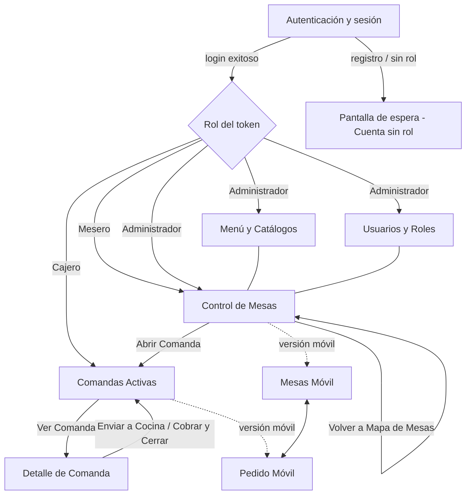
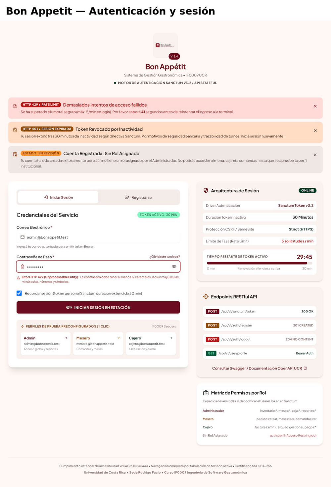
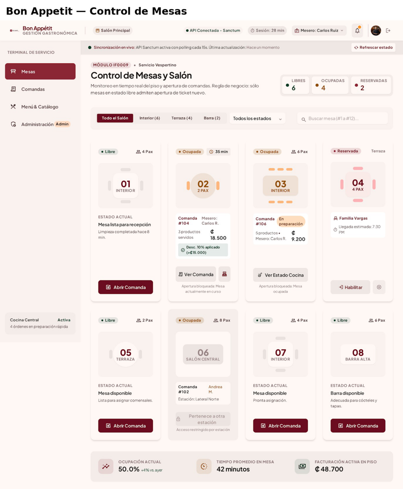
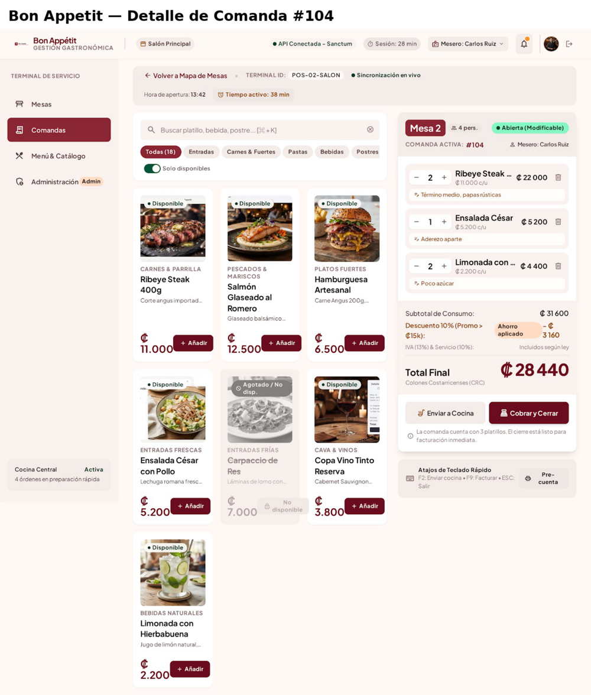

# Laboratorio 7 — Guía de interfaz del proyecto

Este documento define la guía de interfaz que regirá el desarrollo front-end de Bon Appétit, junto con el mapa de navegación y los bosquejos de las tres pantallas principales. Se basa en la propuesta visual del equipo (`bon-appetit-stitch-mockups.pdf`) y retoma/afina el borrador `docs/ui-style-guide.md` iniciado en `feature/gui-ui`.

## 1. Guía de interfaz

### 1.1 Paleta de color y contraste verificado

Paleta inspirada en la identidad gastronómica del restaurante (tonos vino/borgoña y acentos dorados), igual a la usada en las mockups de Stitch.

#### Colores base

| Variable | Nombre | Hex | Uso | Contraste (sobre `#FFFFFF`) | Cumplimiento WCAG |
| :--- | :--- | :--- | :--- | :--- | :--- |
| `--color-primary` | Wine Burgundy | `#6B1D2F` | Encabezados, botones primarios, marca | 7.5:1 | AAA |
| `--color-primary-hover` | Deep Wine | `#4D1220` | Hover/activo de botones primarios | 11.2:1 | AAA |
| `--color-secondary` | Warm Gold | `#C5A059` | Acentos, bordes de foco, detalles | 3.1:1 (nota 1) | AA (solo UI) |
| `--color-bg-main` | Off-White / Cream | `#FAF8F5` | Fondo general de la aplicación | N/A | N/A |
| `--color-surface` | Pure White | `#FFFFFF` | Tarjetas, modales, contenedores | N/A | N/A |
| `--color-text-main` | Charcoal | `#1C1917` | Texto principal (cuerpo y títulos) | 15.8:1 | AAA |
| `--color-text-muted` | Muted Gray | `#666666` | Metadatos, fechas, texto secundario | 5.7:1 | AA |

> Nota 1: `#C5A059` se usa solo como fondo de badges con texto `#1C1917` (contraste 8.2:1, AAA) o como borde decorativo — nunca como texto sobre blanco.

#### Colores de estado

| Estado | Nombre | Hex | Uso | Contraste | Cumplimiento |
| :--- | :--- | :--- | :--- | :--- | :--- |
| Éxito | Forest Green | `#1E5E3A` | Comandas listas, confirmaciones, mesa "Libre" | 7.1:1 | AAA |
| Advertencia | Amber Gold | `#B45309` | Alertas, comanda en proceso, mesa "Ocupada" | 5.4:1 | AA |
| Error / peligro | Crimson Red | `#B91C1C` | Errores de formulario, cancelaciones, alertas críticas | 7.4:1 | AAA |
| Deshabilitado | Neutral Gray | `#E5E7EB` | Fondos inactivos (texto `#9CA3AF`, 3.0:1) | — | Cumple UI |

### 1.2 Tipografía y escala tipográfica

- **Títulos / display:** `Playfair Display`, serif.
- **Cuerpo e interfaz:** `Inter`, sans-serif.

| Nivel | Fuente | Tamaño | Peso | Line-height |
| :--- | :--- | :--- | :--- | :--- |
| `h1` | Playfair Display | 32px (2rem) | 700 (Bold) | 1.2 |
| `h2` | Playfair Display | 24px (1.5rem) | 600 (SemiBold) | 1.3 |
| `h3` | Inter | 20px (1.25rem) | 600 (SemiBold) | 1.4 |
| `body` / `p` | Inter | 16px (1rem) | 400 (Regular) | 1.5 |
| `small` / `caption` | Inter | 14px (0.875rem) | 400 (Regular) | 1.4 |
| `button` / `badge` | Inter | 14px (0.875rem) | 500 (Medium) | 1.0 |

### 1.3 Espaciado (escala base 8px)

| Token | Valor | Uso |
| :--- | :--- | :--- |
| `xs` | 4px | Separación icono-texto en botones/badges |
| `sm` | 8px | Padding interno de badges, separaciones pequeñas |
| `md` | 16px | Padding de botones, inputs y tarjetas |
| `lg` | 24px | Separación entre bloques dentro de un mismo contenedor |
| `xl` | 32px | Margen exterior de secciones principales |
| `2xl` | 48px | Separación entre bloques grandes de la pantalla |

### 1.4 Estados de los componentes

**Botones (`.btn`)**

| Estado | Especificación |
| :--- | :--- |
| Normal | Fondo `#6B1D2F`, texto `#FFFFFF`, borde redondeado 6px |
| Foco | `outline: 2px solid #C5A059`, `outline-offset: 2px` |
| Error / destructivo | Fondo `#B91C1C`, texto `#FFFFFF` |
| Deshabilitado | Fondo `#E5E7EB`, texto `#9CA3AF`, `cursor: not-allowed`, `pointer-events: none` |

**Campos de texto (`input`, `select`, `textarea`)**

| Estado | Especificación |
| :--- | :--- |
| Normal | Fondo `#FFFFFF`, borde `1px solid #D1D5DB`, texto `#1C1917` |
| Foco | Borde `#6B1D2F`, `box-shadow: 0 0 0 3px rgba(107,29,47,0.15)` |
| Error | Borde `#B91C1C` + mensaje inferior en `#B91C1C`, 14px |
| Deshabilitado | Fondo `#F3F4F6`, borde `#E5E7EB`, texto `#9CA3AF`, `cursor: not-allowed` |

**Tarjetas de mesa (`.card`)**

| Estado | Especificación |
| :--- | :--- |
| Libre / disponible | Borde izquierdo verde `#1E5E3A` |
| Ocupada / comanda activa | Borde izquierdo ámbar `#B45309` |
| Seleccionada / foco | Borde perimetral `#C5A059`, 2px |
| Deshabilitada / fuera de servicio | Fondo `#F9FAFB`, borde e icono `#9CA3AF` |

## 2. Mapa de navegación

Flujo de pantallas según el rol autenticado (el token de Sanctum determina qué ramas son accesibles; un usuario sin rol asignado queda bloqueado en Autenticación con acceso solo a su perfil).

**Reglas de navegación clave:**

- Todas las rutas salvo `/login` y `/register` requieren sesión Sanctum activa (ver `docs/lab06-seguridad.md`).
- **Mesero:** Mesas → Comandas Activas → Detalle de Comanda es el flujo principal; solo ve/edita sus propias comandas (`ComandaPolicy`).
- **Cajero:** entra directo a Comandas Activas para cobro/cierre; acceso de solo lectura al detalle de mesas de otros meseros.
- **Administrador:** acceso total, incluye Menú & Catálogos y Usuarios y Roles.
- La barra inferior (`Mesas · Comandas · Rápido · Más`) en móvil replica la navegación principal de escritorio.

## 3. Bosquejos de las tres pantallas principales

Se eligieron las tres pantallas que cubren el flujo de extremo a extremo de un mesero (rol con más interacciones diarias): iniciar sesión, ver el salón y abrir/gestionar una comanda. Los bosquejos provienen de la propuesta visual del equipo en Stitch (`bon-appetit-stitch-mockups.pdf`).

### 3.1 Autenticación y sesión

Login con correo/contraseña, accesos rápidos de demo por rol (Admin / Mesero / Cajero), estado del token Sanctum (duración, rate limit) y manejo visible de errores (429 por rate limit, 401 por token expirado, cuenta sin rol asignado).

### 3.2 Control de Mesas

Mapa del salón con tarjetas de mesa coloreadas por estado (libre/ocupada/reservada), filtros por zona (Interior, Terraza, Barra) y acceso a "Abrir Comanda" solo quedando habilitado en mesas libres, reflejando la regla de negocio ya implementada en `ComandaService`.

### 3.3 Detalle de Comanda

Catálogo de productos filtrable a la izquierda, detalle de la comanda activa a la derecha (línea por producto con notas, subtotal, descuento automático y total), con acciones "Enviar a Cocina" y "Cobrar y Cerrar".
